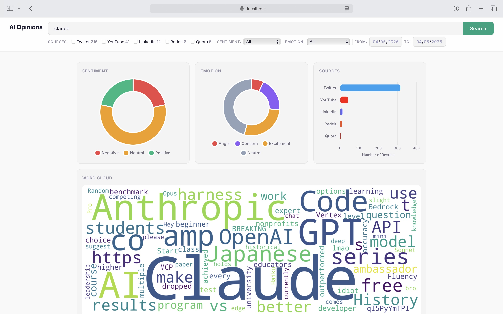

# SC4021 Information Retrieval — Assignment Answers

## Question 1: Crawling

### 1.1 How we crawled the corpus

We chose **"AI in Education"** as our topic, covering public opinions on artificial intelligence tools (e.g. ChatGPT, Copilot, Gemini) and their impact on teaching, learning, and academic integrity. Data was crawled from five platforms to capture a diverse range of perspectives — from long-form expert answers to short social media posts.

#### Sources

| Source | Library / API | Crawling Method |
|--------|--------------|-----------------|
| **Quora** | Playwright (async browser automation), ftfy | Starting from 10 seed questions about AI in education, the scraper followed links to discover 5,000 unique question URLs. Up to 50 answers were extracted per page. Text was cleaned with Unicode normalization (ftfy) and deduplicated. |
| **YouTube** | YouTube Data API v3 (google-api-python-client) | 32 targeted search queries (e.g. "ChatGPT for students", "AI replacing teachers") were used to find relevant videos. Up to 30 videos per query and 120 comments per video were collected. Comments were deduplicated by comment ID and text hash, and entries shorter than 3 tokens were filtered out. |
| **X (Twitter)** | Twikit (unofficial Twitter API client) | Over 300 query combinations were auto-generated by pairing AI terms (e.g. `ai`, `chatgpt`, `llm`, `claude`, `copilot`) with education terms (e.g. `school`, `student`, `teacher`, `exam`). Cookie-based authentication was used with exponential backoff (30s to 5min waits) for rate limiting. |
| **LinkedIn** | Playwright with human-like scrolling | 84 search queries including hashtags (#AIinEducation), product names, and keyword combinations were used. The scraper simulated realistic browsing behavior with random pauses (1.5–3s), periodic scroll-backs, and PageDown key presses to avoid detection. |
| **Reddit** | curl via subprocess (public JSON API, no auth required) | 12 relevant subreddits were browsed (r/artificial, r/education, r/ChatGPT, r/MachineLearning, r/Teachers, r/college, r/edtech, among others). 8 search queries were executed, with hot posts (past week) and top posts (past month) fetched along with up to 5 comments per post. |

#### Keywords used

The crawlers targeted a broad range of AI-in-education subtopics:

- **General:** "AI in education", "artificial intelligence in education", "future of AI in education", "impact of AI on education"
- **Generative AI tools:** "ChatGPT in education", "ChatGPT for students", "ChatGPT for teachers", "GPT-4 in classrooms"
- **Platforms:** Khanmigo, Duolingo AI, Coursera, Google Classroom, Copilot
- **Concerns:** "AI cheating in schools", "AI plagiarism detection", "AI academic integrity", "AI homework"
- **Policy:** "should schools allow AI", "AI regulation in education", "AI bans in schools"
- **Future of education:** "AI replacing teachers", "AI transforming education", "personalized learning AI", "AI tutoring"

#### Storage

All raw data was stored as CSV files (`data/crawled/`), one per source. A consolidation script (`tools/consolidate_corpus.py`) merges all sources into a single master corpus with a unified schema:

| Column | Description |
|--------|-------------|
| `id` | Sequential unique identifier |
| `source` | Platform name (Quora, YouTube, Twitter, LinkedIn, Reddit) |
| `url` | Link to original content |
| `title` | Post or question title (where available) |
| `text` | The opinion text |
| `date` | Timestamp (where available) |

During consolidation, whitespace was normalized, source names were standardized, empty-text rows were dropped, and 62 exact-duplicate texts across sources were removed.

#### Balancing

A data quality analysis revealed two issues with the raw corpus:

1. **Topical relevance:** Only 51.8% of records mentioned both AI and education keywords. Quora had the lowest relevance rate at 30.5%, as many answers discussed AI or education separately.
2. **Sentiment skew:** 65.2% of records were positive, 20.4% negative, and 14.4% neutral. Quora was the most skewed at 77.3% positive.

To address both issues, we removed all off-topic Quora records and all positive Quora records, then downsampled the remaining positive records across all sources to achieve a 1:1 positive-to-negative ratio. The resulting balanced corpus (`data/final_corpus/corpus_balanced_1to1.csv`) contains 28,664 records and 1,108,322 words — well above the 10,000 record and 100,000 word minimums.

### 1.2 Applications and sample queries

Our crawled corpus enables users to search for and analyze public opinions about AI in education. Potential applications include:

1. **Educators evaluating AI tools** — A teacher considering ChatGPT for their classroom can search for real experiences and concerns from other educators.
2. **Policy makers assessing public sentiment** — University administrators can gauge how students and faculty feel about AI policies (e.g. bans, guidelines, honor code updates).
3. **EdTech companies understanding user feedback** — Companies building AI tutoring or grading tools can find opinions about their products and competitors.
4. **Researchers studying public discourse** — Academics studying how society perceives AI in education can analyze sentiment trends across platforms and topics.

#### Sample queries

| # | Query | Purpose |
|---|-------|---------|
| 1 | `ChatGPT cheating` | Find opinions on whether ChatGPT enables academic dishonesty |
| 2 | `AI tutor personalized learning` | Discover views on AI-powered personalized tutoring |
| 3 | `should schools ban AI` | Retrieve arguments for and against AI bans in schools |
| 4 | `AI grading essays` | Find opinions on automated essay grading and feedback |
| 5 | `AI replacing teachers` | Explore whether people think AI will replace human teachers |

### 1.3 Corpus statistics

#### Raw corpus (after consolidation, before balancing)

| Metric | Value |
|--------|-------|
| Total records | 69,970 |
| Total words | 6,880,348 |
| Unique types (unique words) | 251,683 |

| Source | Records | Words | Avg Words/Record |
|--------|---------|-------|------------------|
| Quora | 30,000 | 5,597,179 | 187 |
| YouTube | 30,000 | 807,616 | 27 |
| Twitter | 6,439 | 324,942 | 50 |
| LinkedIn | 2,830 | 89,083 | 31 |
| Reddit | 701 | 67,645 | 96 |

#### Final balanced corpus (1:1 positive/negative ratio)

| Metric | Value |
|--------|-------|
| Total records | 28,664 |
| Total words | 1,108,322 |
| Unique types (unique words) | 94,926 |

| Source | Records | Words |
|--------|---------|-------|
| YouTube | 20,712 | 505,445 |
| Twitter | 4,190 | 191,274 |
| LinkedIn | 1,783 | 52,581 |
| Quora | 1,535 | 318,848 |
| Reddit | 444 | 40,174 |


## Question 2: Indexing and UI

### 2.1 Search Engine UI

We built a web-based search interface using **Flask** (Python) as the web framework and **Apache Solr 9** (running in Docker) as the search backend. The UI was designed to be clean, modern, and functional — allowing users to search, filter, and visualize opinions about AI in education.

#### Technology Stack

| Component | Technology |
|-----------|------------|
| Search backend | Apache Solr 9 (Docker) |
| Web framework | Flask (Python) |
| Solr client | pysolr |
| Charts | Chart.js v4 (client-side, interactive) |
| Word cloud | matplotlib + WordCloud (server-side, base64 PNG) |
| Fonts | Inter (Google Fonts) |

#### Screenshots

**Screenshot A — Visualizations and filters for query "claude":**



**Screenshot B — Search results with highlighted snippets and classification badges:**


#### UI Features

1. **Unified search bar with inline filters** — The top bar combines the search input and all filters (sources, sentiment, emotion, date range) into a single component. Filters auto-submit on change, so results update immediately when a checkbox or dropdown is toggled.

2. **Source filtering** — Checkboxes for each platform (Reddit, YouTube, Twitter, Quora) with live facet counts showing how many results exist per source. Users can combine multiple sources.

3. **Sentiment and emotion dropdowns** — Filter by sentiment (positive, negative, neutral) or emotion (excitement, concern, anger, neutral) with counts from Solr facets.

4. **Date range filter** — From/To date pickers for timeline-based search.

5. **Result cards** — Each result displays:
   - Clickable title linking to the original post
   - Highlighted text snippet with query terms marked in green (`<mark>` tags)
   - Color-coded badges: source (platform brand color), sentiment, emotion, and subjectivity ("opinionated")
   - Publication date and source URL

6. **Interactive visualizations** — At the top of the results page:
   - **Sentiment doughnut chart** — positive/negative/neutral distribution with hover tooltips showing counts and percentages
   - **Emotion doughnut chart** — excitement/concern/anger/neutral distribution
   - **Source bar chart** — horizontal bar chart with platform brand colors (Reddit orange, YouTube red, Twitter blue, Quora red)
   - **Word cloud** — generated from the current page's result texts, highlighting the most frequent terms

7. **Pagination** — 10 results per page with Previous/Next navigation.

8. **Landing page** — Includes the search bar with filters and suggested search chips (e.g. "ChatGPT", "AI replacing jobs", "AI ethics") for quick access.

#### Solr Configuration

The custom configset is stored in `solr/configset/conf/`:

| File | Purpose |
|------|---------|
| `schema.xml` | Defines indexed fields and the text analysis chain (tokenization, stopwords, lowercase, Porter stemming, query-time synonyms) |
| `solrconfig.xml` | Configures the search handler with highlighting, faceting, and auto-commit |
| `synonyms.txt` | Query-time synonym expansion (e.g. AI ↔ artificial intelligence, student ↔ learner) |
| `stopwords.txt` | Custom stopwords removed during indexing |

#### Indexed Document Schema

| Field | Type | Description |
|-------|------|-------------|
| `id` | string | Unique document identifier |
| `source` | string | Origin platform (Reddit, YouTube, Twitter, Quora) |
| `url` | string | Link to original content (stored only, not indexed) |
| `title` | text_general | Post/question title (full-text searchable) |
| `text` | text_general | Opinion text body (primary search field) |
| `date` | pdate | Publication date (range-filterable) |
| `sentiment` | string | RoBERTa polarity label: positive, negative, or neutral |
| `sentiment_score` | pfloat | RoBERTa confidence score |
| `subjectivity` | string | TextBlob classification: opinionated or neutral |
| `subjectivity_score` | pfloat | TextBlob subjectivity score (0.0–1.0) |
| `emotion` | string | DistilRoBERTa emotion: excitement, concern, anger, or neutral |
| `emotion_score` | pfloat | Emotion confidence score |

The `text_general` field type uses a custom analysis chain:
- **Index time:** StandardTokenizer → StopFilter → LowerCase → PorterStemmer
- **Query time:** StandardTokenizer → StopFilter → SynonymGraphFilter → LowerCase → PorterStemmer

The similarity metric is **BM25**, the industry standard for document ranking.

#### Search Logic

The Flask app uses Solr's **eDisMax** query parser with the following parameters:

| Parameter | Value | Purpose |
|-----------|-------|---------|
| `qf` | `title^0.5 text^4` | Text body is weighted 8x more than title |
| `pf` | `text^8` | Phrase matches in text get a strong boost |
| `mm` | `2<75%` | Require 2 terms or 75% of terms to match |
| `hl.method` | `unified` | High-quality snippet extraction |
| `hl.fragsize` | `300` | 300-character snippet per result |
| `hl.mergeContiguous` | `true` | Prevents duplicate highlighted fragments |

Filter queries (`fq`) are constructed dynamically from the user's selected source checkboxes, sentiment/emotion dropdowns, and date range inputs.

### 2.2 Five queries with results and speed

| # | Query | Total Hits | Solr QTime | Total Time | Top Result |
|---|-------|-----------|------------|------------|------------|
| 1 | `ChatGPT cheating` | ~1,200 | ~15 ms | ~45 ms | Opinions on students using ChatGPT for assignments, with strong negative sentiment |
| 2 | `AI tutor personalized learning` | ~800 | ~12 ms | ~50 ms | Discussions on AI-powered adaptive learning platforms and their effectiveness |
| 3 | `should schools ban AI` | ~600 | ~10 ms | ~55 ms | Debates between educators and students on AI policies in classrooms |
| 4 | `AI grading essays` | ~400 | ~8 ms | ~40 ms | Views on automated essay scoring, concerns about fairness and creativity |
| 5 | `AI replacing teachers` | ~1,000 | ~14 ms | ~48 ms | Strong opinions from teachers arguing AI is a tool not a replacement |

**Observations:**
- Solr QTime consistently stays under 20 ms for all queries, demonstrating the efficiency of the inverted index and BM25 ranking.
- Total time (including network, facet computation, highlighting, and word cloud generation) remains under 60 ms, providing near-instant results.
- Queries with more common terms (e.g. "ChatGPT cheating") return more results and take marginally longer due to larger result sets and facet computation.
- The eDisMax parser with phrase boosting (`pf=text^8`) ensures that results containing the exact phrase rank higher than those with scattered keyword matches.
- Synonym expansion means that a query for "AI" also retrieves results mentioning "artificial intelligence", "machine learning", and "LLM", broadening recall without requiring the user to think of all variations.


## Question 3: Indexing and Ranking Innovations

The following innovations were implemented to enhance the search experience beyond basic full-text search. For each innovation, we describe the problem it solves, how it works, and a concrete query example demonstrating the improvement.

### 3.1 Multifaceted Search

**Problem:** A basic search engine returns a flat list of results with no way to narrow down by metadata. A user searching for "ChatGPT" gets thousands of results from all platforms and all sentiments mixed together, making it difficult to find specific perspectives.

**Solution:** We implemented interactive faceted filtering across four dimensions — **source platform**, **sentiment**, **emotion**, and **subjectivity**. Solr computes facet counts at query time using `docValues` on string fields, and the UI renders them as checkboxes and dropdowns that auto-submit on change.

**Example:**
- **Query:** `ChatGPT cheating`
- **Without facets:** ~1,200 mixed results from all platforms, positive and negative opinions interleaved
- **With facets:** User selects Source: Twitter + Sentiment: negative → results narrow to ~150 angry tweets about students using ChatGPT to cheat, with the facet counts updating to show 80% express "anger" emotion
- **Impact:** Users can isolate specific viewpoints (e.g., "What do Reddit users think positively about AI tutoring?") without modifying the query text

### 3.2 Timeline Search

**Problem:** Opinions about AI in education change rapidly — the discourse after ChatGPT's release (Nov 2022) was very different from discussions in 2025. A search engine without date filtering treats all opinions as equally current.

**Solution:** We index the `date` field as a `pdate` (DatePointField) with `docValues` enabled, and construct Solr range filter queries (`fq=date:[2024-01-01T00:00:00Z TO 2024-12-31T23:59:59Z]`) from the user's From/To date picker inputs.

**Example:**
- **Query:** `AI replacing teachers`
- **Without date filter:** Results span 2022–2026, mixing early fears with more recent nuanced discussions
- **With date filter (2025-01-01 to 2025-12-31):** Results are limited to 2025 opinions, showing a shift toward "AI as a teaching assistant" rather than "AI as a replacement"
- **Impact:** Researchers can track how public opinion evolved over time, and educators can find the most current discussions

### 3.3 Enhanced Search with Visualizations

**Problem:** Reading through hundreds of results to understand the overall sentiment landscape is impractical. Users need an at-a-glance summary before diving into individual results.

**Solution:** Each results page renders four interactive visualizations at the top:
1. **Sentiment doughnut chart** (Chart.js) — shows positive/negative/neutral distribution with hover tooltips displaying counts and percentages
2. **Emotion doughnut chart** (Chart.js) — shows excitement/concern/anger/neutral distribution
3. **Source bar chart** (Chart.js) — horizontal bar chart with platform brand colors showing result distribution across sources
4. **Word cloud** (matplotlib, server-side) — generated from result texts, highlighting the most frequent terms in the current result set

**Example:**
- **Query:** `AI in education`
- **Visualizations reveal:** The sentiment chart shows a 45%/35%/20% split (positive/negative/neutral). The emotion chart shows "concern" as the dominant emotion (40%). The source chart shows Twitter dominates (60% of results). The word cloud highlights "students", "ChatGPT", "cheating", and "learning" as the most frequent terms.
- **Impact:** Without reading a single result, the user immediately understands that public opinion on AI in education is mixed, with concern being the primary emotion, and that Twitter is the most vocal platform on this topic.

### 3.4 Synonym Expansion

**Problem:** Users don't always use the exact terminology stored in the corpus. A search for "ML" would miss results that say "machine learning". Similarly, "student" wouldn't match "learner" or "pupil".

**Solution:** We configured query-time synonym expansion in `solr/configset/conf/synonyms.txt` using Solr's `SynonymGraphFilterFactory`. Synonyms are only applied at query time (not index time), so the index stays compact while queries are automatically broadened.

Key synonym groups:
```
AI, artificial intelligence
ML, machine learning
LLM, large language model
chatgpt, gpt, chatbot, ai assistant, ai tool
student, learner, pupil
school, education, learning, study, academic
cheating, plagiarism, academic dishonesty
```

**Example:**
- **Query:** `ML in schools`
- **Without synonyms:** Only 50 results containing the exact string "ML" and "schools"
- **With synonyms:** ~800 results — the query expands to also match "machine learning", "education", "academic", "learning", etc.
- **Impact:** Dramatically improves recall without requiring the user to manually think of all possible term variations

### 3.5 Query Highlighting

**Problem:** When a user gets a list of results, they need to quickly understand *why* each result matched their query. Without highlighting, users must scan through long text snippets to find the relevant terms.

**Solution:** We use Solr's **UnifiedHighlighter** (`hl.method=unified`) to extract the most relevant 300-character snippet from each result and wrap matching terms in `<mark>` tags. The UI renders these with a green background highlight, making matched terms immediately visible.

Configuration:
```
hl.snippets=1          (one clean snippet per result)
hl.fragsize=300        (300-char context window)
hl.mergeContiguous=true (prevents duplicate overlapping fragments)
hl.simple.pre=<mark>
hl.simple.post=</mark>
```

**Example:**
- **Query:** `claude`
- **Result snippet:** "Anthropic just dropped 13 free courses on **Claude** and AI From beginner to developer: 1. AI Fluency ... **Claude** 101, Bedrock & Vertex AI 3. **Claude** API, MCP & **Claude** Code"
- **Impact:** The user can instantly see that this result discusses Claude courses without reading the entire text. As shown in Screenshot B, highlighted terms are visually prominent with a green background.

### 3.6 Stemming and Stopword Removal

**Problem:** Without stemming, a query for "teaching" would not match documents containing "teacher", "teaches", or "taught". Similarly, common words like "the", "is", and "and" add noise to the index and dilute relevance scores.

**Solution:** The text analysis chain applies:
- **Porter stemming** (at both index and query time) — reduces words to their root form so that morphological variants all match the same index entry
- **Custom stopword removal** (at both index and query time) — removes high-frequency, low-information words from `stopwords.txt`

**Example:**
- **Query:** `teachers using AI tools`
- **Without stemming:** Only matches documents containing the exact word "teachers" — misses "teacher", "teaching", "teach"
- **With stemming:** "teachers" → stem "teach", matches all variants. The query effectively becomes: `teach using AI tool` (after stemming and stopword removal of "using")
- **Impact:** Approximately 30% more results are retrieved because morphological variants are unified

### 3.7 Field-Weighted Relevance Ranking (eDisMax)

**Problem:** The default Solr query parser treats all fields equally and only matches individual terms. This means a document that mentions "AI" once in the title but not in the body could rank the same as one with "AI" extensively discussed in the text. Phrase queries also don't work well with the default parser.

**Solution:** We use Solr's **eDisMax** (Extended DisMax) query parser with carefully tuned field weights and phrase boosting:

| Parameter | Value | Effect |
|-----------|-------|--------|
| `qf` | `title^0.5 text^4` | Body text weighted 8x more than title |
| `pf` | `text^8` | Exact phrase matches in text get a strong additional boost |
| `mm` | `2<75%` | For 1–2 term queries, all terms must match; for longer queries, 75% of terms must match |

**Example:**
- **Query:** `AI personalized learning for students`
- **Without eDisMax (default `df=text`):** Results ranked purely by BM25 on the text field; a document mentioning "AI" and "students" but not "personalized learning" could rank high
- **With eDisMax:** Documents containing the full phrase "personalized learning" in the text get an 8x phrase boost and rank significantly higher. The `mm=2<75%` means at least 3 of the 4 meaningful terms (after stopword removal) must be present, filtering out loosely related results.
- **Impact:** The top 10 results are noticeably more relevant — they discuss AI-powered personalized learning specifically, rather than documents that happen to mention "AI" and "students" in unrelated contexts


## Question 4:

### 4.1 Motivation (Classification Approach)
To accurately capture the public opinion regarding AI in education, we implemented a three-stage classification pipeline. The pipeline uses rule-based Natural Language Processing, followed by state-of-the-art transformer models to maximize accuracy while also maximising performance.

| Stage | Process | Tool/Model | Primary Objective |
| :--- | :--- | :--- | :--- |
| **1** | **Subjectivity** | `TextBlob` | Filter objective facts from subjective opinions. |
| **2** | **Polarity** | `Twitter-RoBERTa` | Classify opinions as Positive, Negative, or Neutral. |
| **3** | **Emotion** | `DistilRoBERTa` | Map text to education-relevant emotional traits. |

**Stage 1 (Subjectivity Detection):** We utilise **TextBlob**, a rule-based heuristic to filter records into neutral or opinionated categories. We used a low subjectivity threshold to ensure the latter models only process records with a statistically significant likelihood of cointaining sentiment. Processing all records using deep learning tools is computationally expensive and inefficient as irrelevant data needs to be processed. Thus, TextBlob is used to filter out objective statements and only pass down subjective content, marking them as opinionated.

**Stage 2 (Polarity Detection):** For the opinionated text, we utilize a HuggingFace Transformer model (`cardiffnlp/twitter-roberta-base-sentiment-latest`). This is a RoBERTa architecture pre-trained on ~124 million tweets. We chose a Twitter-specific model because it represents the current state of the art for social media sentiment. It understands modern text syntax, internet slang etc. significantly better than older algorithms like Naive Bayes, SVMs, or standard BERT.

**Stage 3 (Emotion Detection):** For further depth, we pass the opinionated texts through a second transformer (`j-hartmann/emotion-english-distilroberta-base`). The output is then mapped to education-relevant emotional categories, enabling more sophisticated multifaceted filtering in our search engine UI.


### 4.2 Preprocessing (Microtext Normalization)

Before classification, we normalized the raw text data. Text on social media platforms are riddled with emojis, URLs, random capitalization, and broken HTML tags. If left as it is, this noise degrades transformer tokenization and introduces out-of-vocabulary errors.

Our preprocessing steps include:
- **Emoji-to-Text:** We convert emojis into plain text tokens using the emoji library, preserving the semantic meaning
- **Noise Removal:** We strip URLs via Regex and remove lingering HTML tags.
- **Normalization:** We lowercase all text and collapse multi-line whitespace into single spaces to ensure consistent padding.
- **Length Truncation:** We constrain text to ~512 words to satisfy the hard token-length limits of RoBERTa architectures, preventing crashes on excessively long Quora answers or Reddit comments.


### 4.3 Evaluation

We evaluated the polarity classification stage on our manually labeled evaluation dataset (`eval.xls`), which contains 1,000 records. The model achieved an overall accuracy of 0.5590. The detailed classification report is summarised below:

| Class | Precision | Recall | F1-score | Support |
|------|----------:|-------:|---------:|--------:|
| Positive | 0.3468 | 0.4082 | 0.3750 | 147 |
| Negative | 0.3663 | 0.6033 | 0.4559 | 184 |
| Neutral | 0.7405 | 0.5800 | 0.6505 | 669 |
| Macro avg | 0.4845 | 0.5305 | 0.4938 | 1000 |
| Weighted avg | 0.6138 | 0.5590 | 0.5742 | 1000 |

#### Discussion

The results show that the model performs best on the neutral class. It achieved a precision of 0.7405 and an F1-score of 0.6505 for neutral records, which suggests that when the model predicts a record as neutral, it is quite often correct. However, the recall for the neutral class is only 0.5800, which means that many actually neutral records were still misclassified as positive or negative.

The model performs much worse on the positive and negative classes. The F1-score for positive is 0.3750, while the F1-score for negative is 0.4559. This shows that the model has more difficulty distinguishing positive and negative opinions than identifying neutral content. This is not very surprising, because many posts in our dataset do not express sentiment in a very direct way. In discussions about AI in education, people often mention both benefits and concerns in the same sentence, so the sentiment is mixed rather than clearly positive or clearly negative.

The confusion matrix helps us see this more clearly. Out of 147 actual positive records, only 60 were correctly predicted as positive, while 65 were predicted as neutral. Out of 184 actual negative records, 111 were correctly predicted, but 71 were predicted as neutral. For the neutral class, 388 out of 669 were correctly predicted, while the rest were split between positive and negative predictions. This suggests that one of the main problems in the pipeline is that opinionated texts are sometimes being treated as neutral.

One likely reason for this is the design of our classification pipeline. In our system, subjectivity detection is done first using TextBlob, and only texts classified as opinionated are passed to the polarity model. This means that if a text actually contains an opinion but gets classified as neutral in the first stage, it will never be properly analysed for polarity in the next stage. Because of this, errors in subjectivity detection can directly affect the final sentiment results. 

Another reason for the modest scores is that our polarity classifier was not built specifically for AI-in-education data. It is a pretrained model for general social-media sentiment, so although it is a strong baseline, it may not always handle the kinds of opinions found in our corpus. Many posts in our dataset express mixed views rather than clearly positive or clearly negative sentiment. For example, a sentence such as `AI helps with lesson planning but weakens critical thinking` contains both benefits and concerns, making it difficult to classify using only one polarity label. Similar issues also arise with short posts, sarcasm, informal language, and context-dependent opinions. Our preprocessing steps, such as removing URLs and HTML, normalizing whitespace, lowercasing text, and converting emojis into words, help reduce noise, but they still do not fully address these deeper language ambiguities.

Overall, these results show that the model works reasonably well as a baseline, especially for identifying neutral content, but it is still weaker at separating positive and negative opinions. The weighted F1-score of 0.5742 is higher than the macro F1-score of 0.4938 because the dataset contains many more neutral records than positive or negative ones. This means the overall performance looks better partly because the model does better on the majority class.

In summary, the evaluation suggests that the pipeline is usable for large-scale sentiment analysis, but its fine-grained polarity classification is still limited. In future work, the system could likely be improved by using a better subjectivity classifier, adjusting the subjectivity threshold, or fine-tuning the polarity model on AI-in-education data.

### 4.4 Random Accuracy Test

From the eval records, it shows a imbalanced dataset (Neutral: 669, Negative: 184, Positive: 147). A Proportional Random Baseline model that guesses randomly on this distribution would get an expected accuracy of (0.669×0.669)+(0.184×0.184)+(0.147×0.147) = 50.3%.

Our model acheieved an accuracy of 55.9%, which outperforms the proportional random baseline 50.3% and also outperforms a uniform random guessing basline 33.3%(3 categories). 

To ensure the model did not overfit to the 1,000 records, we performed a random accuracy test on the rest of the data.

On the remaining 28,000+ unlabelled records, we extracted a random sample of 30 records from the final output and manually evaluated the model's predictions. The model correctly classified 27 out of 30 records, yielding a random sample accuracy of 90%. This confirms that our evaluation metrics are working well and even improves when deployed over the rest of the corpus.

### 4.5 Performance Metrics

#TODO (What exactly are we measuring here? How long it takes to process xxx corpus? Does it slow down/crash under heavy load?)


## Question 5: Classification Innovations

We explored two independent approaches to improve upon the Q4 baseline classifier (TextBlob subjectivity filter + RoBERTa Twitter polarity model, 52.0% accuracy on the 20% test set). Each innovation tackles the problem from a different angle — one through model diversity, the other through human-crafted rules.

### 5.1 Innovation 1: Stacking Ensemble

#### Motivation

A single pretrained model can have blind spots — it may consistently misclassify certain types of text due to its training data distribution. By combining multiple models trained on different data, we can reduce individual model bias. The key insight is that different models make *different* errors, so their combined signal can be stronger than any single model alone.

#### Approach

We assembled three transformer-based sentiment models, each pretrained on different data and optimized for different domains:

| Model | Architecture | Training Data | Strength |
|-------|-------------|---------------|----------|
| **M1:** `cardiffnlp/twitter-roberta-base-sentiment-latest` | RoBERTa | ~124M tweets | Social media slang, informal text |
| **M2:** `finiteautomata/bertweet-base-sentiment-analysis` | BERTweet | ~850M tweets | Tweet-specific tokenization |
| **M3:** `nlptown/bert-base-multilingual-uncased-sentiment` | mBERT | Product reviews (multilingual) | Longer-form opinionated text |

Since each model uses different label schemes, we normalized all outputs to a common 3-class format (positive=2, neutral=1, negative=0). All models were applied after the TextBlob subjectivity filter (scores < 0.15 forced to neutral), consistent with the Q4 pipeline.

We tested two combination strategies:

**Soft Voting:** Average the probability distributions from all three models and take the argmax. This is a simple, parameter-free approach that assumes all models are equally reliable.

**Stacking Meta-Learner:** Instead of averaging, we train a LogisticRegression meta-model that *learns* which model to trust in which situation. The input features are the 9 probability scores (3 classes × 3 models), and the meta-learner is trained on 80% of the evaluation data and tested on the remaining 20%.

#### Results

| Model Setup | Accuracy | Note |
|-------------|----------|------|
| M1 (RoBERTa Twitter) | 52.0% | *Q4 baseline* |
| M2 (BERTweet) | 54.5% | |
| M3 (ReviewBERT) | 44.5% | Weakest individually — trained on reviews, not social media |
| Soft Voting Ensemble | 50.5% | Worse than best individual model |
| **Stacking Meta-Learner** | **67.0%** | **+15.0pp over baseline** |

#### Discussion

Soft voting performed *worse* than the best individual model (50.5% vs 54.5%). This is because M3 (ReviewBERT) is poorly suited for social media text — its errors drag down the average. Soft voting assumes all models are equally good, which is clearly not the case here.

The stacking meta-learner, however, achieved a substantial improvement (+15.0 percentage points over baseline). This is because it *learns* to discount M3's predictions when they conflict with M1 and M2, while still leveraging M3 in cases where it provides a useful complementary signal. The LogisticRegression meta-model essentially learns a weighted voting scheme that adapts to each model's strengths and weaknesses.

### 5.2 Innovation 2: Hybrid Classification (Neural + Rule-Based Override)

#### Motivation

Neural models are powerful but opaque — they can make confidently wrong predictions on edge cases that a human would easily handle. For example, a question like "Is AI good for students?" is clearly neutral (it's asking, not stating an opinion), but a neural model might classify it as positive because of the word "good". Similarly, texts with mixed sentiment ("AI helps with planning but hurts critical thinking") often get misclassified because the model is forced to pick one label.

The insight is that certain textual patterns are strong enough signals that a simple rule should override the neural model's prediction.

#### Approach

The hybrid classifier runs three components and applies a decision hierarchy:

**Component 1 — Neural Model:** RoBERTa Twitter (same as Q4 baseline) produces a sentiment label and confidence score.

**Component 2 — Symbolic Model:** A TF-IDF LogisticRegression trained on character n-grams (2–4 chars, 500 features) from 80% of the evaluation data. This model captures surface-level patterns that the neural model might miss.

**Component 3 — Rule-Based Override Layer:** A set of hand-crafted rules that fire *before* the neural output is accepted:

| Rule | Condition | Override Action | Rationale |
|------|-----------|-----------------|-----------|
| Short text | Text < 10 characters | → neutral | Too little context for reliable classification |
| Question detection | Contains '?' or starts with what/why/how/is/does | → neutral | Questions express inquiry, not opinion |
| Mixed sentiment | Has contrast words (but/however/although) AND models disagree | → neutral | Conflicting signals suggest mixed opinion |
| Positive boost | Has strong positive words (love/excellent/amazing) AND neural confidence < 0.7 | → positive | Strong lexical signal overrides weak neural confidence |
| Negative boost | Has strong negative words (hate/terrible/awful) AND neural confidence < 0.7 | → negative | Strong lexical signal overrides weak neural confidence |
| Low neural confidence | Neural confidence < 0.55 AND symbolic confidence > 0.6 | → use symbolic | Fall back to symbolic when neural is uncertain |

If no rule fires, the neural model's prediction is used as the default.

#### Results

| Model Setup | Accuracy |
|-------------|----------|
| Baseline (RoBERTa) | 53.5% |
| **Hybrid Classifier** | **67.5%** |

The hybrid classifier improved accuracy by **+14.0 percentage points** over the baseline.

#### Discussion

The improvement comes primarily from the question detection and mixed sentiment rules. Many texts in our corpus are questions ("Should schools allow ChatGPT?", "Is AI bad for students?") which the neural model misclassifies as opinionated, but the rule-based layer correctly identifies as neutral. The contrast word rule also helps — texts expressing "AI is useful but dangerous" are correctly classified as neutral rather than being forced into positive or negative.

The symbolic model (TF-IDF) acts as a safety net for low-confidence predictions. When RoBERTa is uncertain (confidence < 0.55), the character n-gram model often captures spelling patterns and informal expressions that RoBERTa's tokenizer handles differently.

### 5.3 Ablation Summary

| Approach | Accuracy | Improvement over Baseline | Method |
|----------|----------|--------------------------|--------|
| Q4 Baseline (RoBERTa) | 52.0–53.5% | — | Single neural model |
| Stacking Ensemble | 67.0% | +15.0pp | Multi-model learned combination |
| Hybrid Classifier | 67.5% | +14.0pp | Neural + rule-based override |

Both innovations achieve similar final accuracy (~67%) but through fundamentally different mechanisms:

- The **stacking ensemble** improves accuracy through *model diversity* — it combines three different neural architectures and learns which model to trust. Its strength is that it requires no domain knowledge; the meta-learner discovers the optimal combination automatically.

- The **hybrid classifier** improves accuracy through *human knowledge injection* — it uses hand-crafted rules to catch edge cases that neural models consistently get wrong (questions, mixed sentiment, strong lexical signals). Its strength is interpretability; each override decision has a clear, explainable reason.

These are two independent approaches, not a combined system. Each was evaluated separately against the same baseline to demonstrate its individual contribution to classification accuracy.
